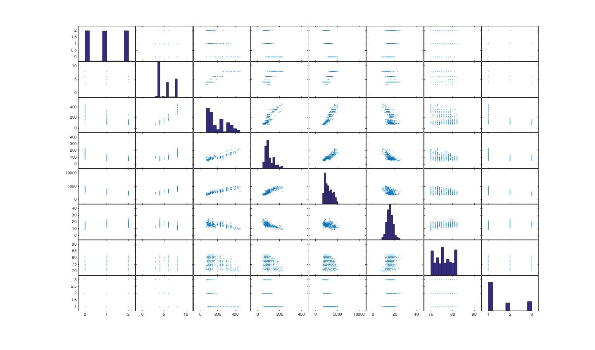
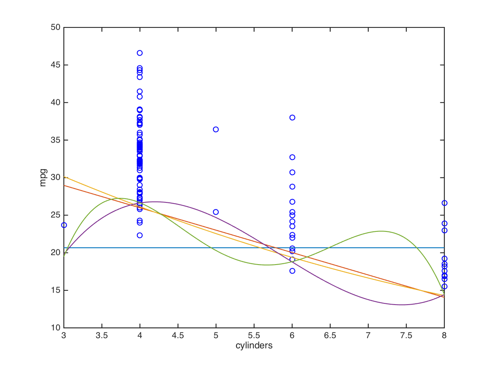
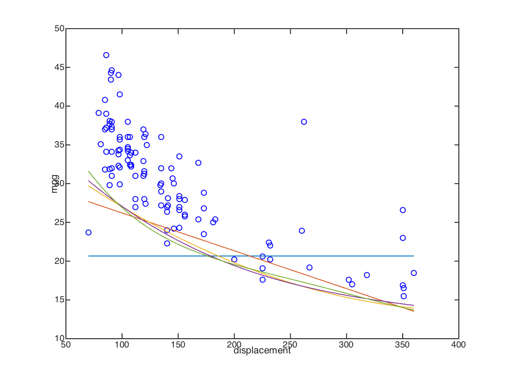
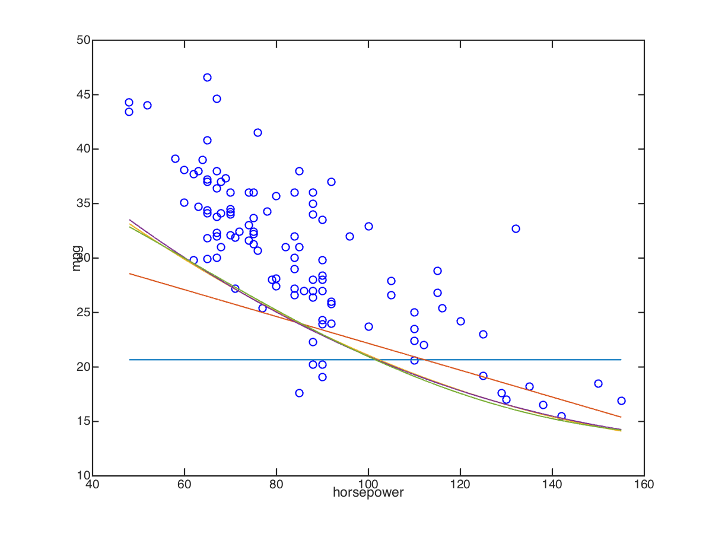
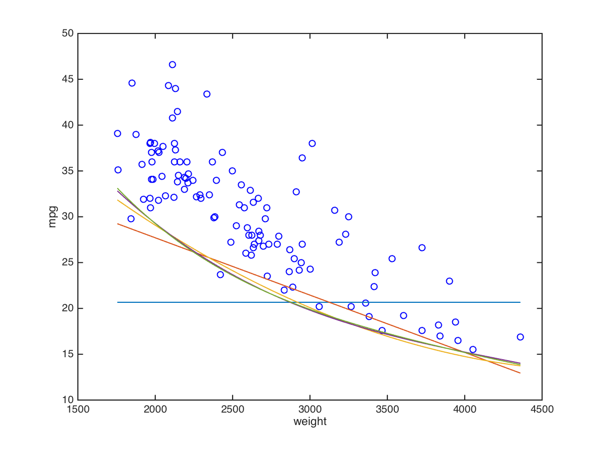
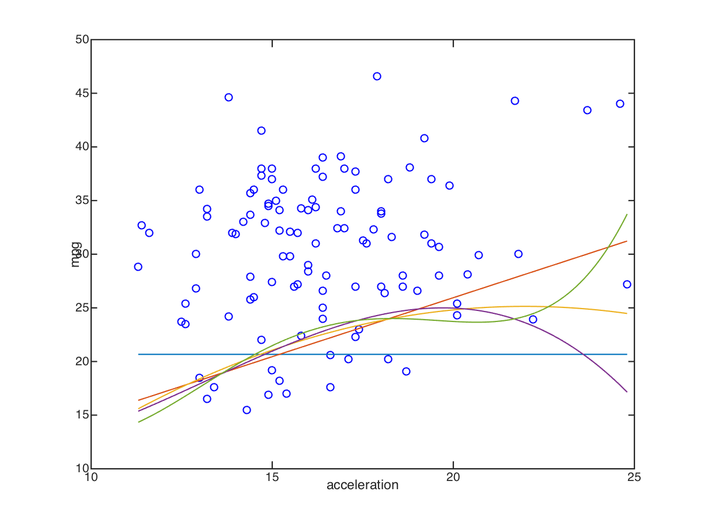
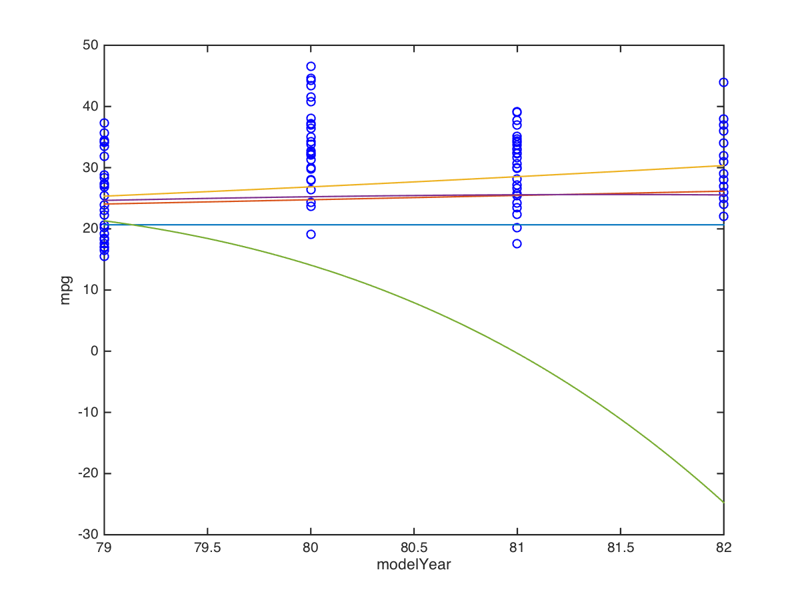
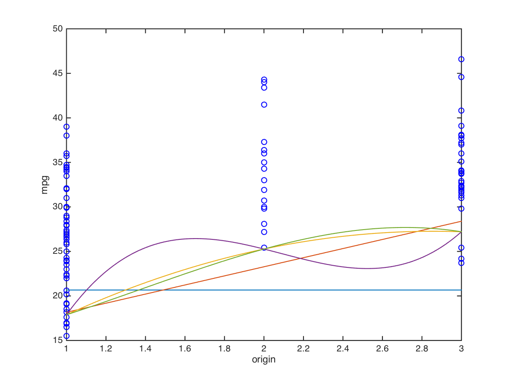

# Report for ECS171, Assignment 1

## Zhen Zhang

First I transform the data into csv format, and then delete the missing values for later use. Then I read in the data, and define two variables that will be used afterwards. More information can be seen in HW1.m line 6-9.

```matlab
d = readtable('~/desktop/auto-mpg.csv','delimiter',',');
d_name = {'mpg','cylinders','displacement','horsepower','weight','acceleration','modelYear','origin'};
d_mat = table2array(d(:,1:8));
```

1. The first question is easy. Just use the quantile function at the one third and two thirds quantile, then the results will reveal.

  ```matlab
  quantile(table2array(d(:,1)),[1/3,2/3]);
  ```

  The result is 18.6667 and 26.9667, respectively.

2. Here I will use the function `plotmatrix()` in the display function. It accepts a matrix as input, and then categorize the first column as three levels, then draw the plot as pairs between any two columns.

  The figure is shown below:

  

  Here I can see that cylinders and origin are related to the three levels of mpg, which can categorize mpg perfectly.

3. The functions related to this question are: dimExpand.m, singlePolyReg.m

  First, I will expand the vector to a matrix, at least add a column of all ones, since the intercept will be in the beta vector then as well. After that, I will use ordinary linear square (OLS) to calculate the coefficients.

4. The split of data I use here is just the first 280 observations, say 1:280 are used for training, and the remaining 112 observations, say 281:392 are used for test. I can do this without loss of generality, since shuffle will have no difference with the original dataset.

  First pass the data to the dimExpand, it will expand the dimension based on the order. Then pass this new matrix to singlePolyReg, it will give us the coefficients. Next, go to genCoef, it will give us a cell containing five coefficients from order 0 to order 4. Last, pass the coefficients to the mse function to calculate mse, to the singlePolyPlot function to draw the figure.

  The result is below:

  **cylinders**

  The Mean Square Error for order 0: train: 39.617232, test: 142.297162

  The Mean Square Error for order 1: train: 12.561711, test: 69.428468

  The Mean Square Error for order 2: train: 12.462434, test: 69.473375

  The Mean Square Error for order 3: train: 11.130620, test: 65.237701

  The Mean Square Error for order 4: train: 11.099744, test: 66.915357

  

  **displacement**

  The Mean Square Error for order 0: train: 39.617232, test: 142.297162

  The Mean Square Error for order 1: train: 11.009492, test: 65.273764

  The Mean Square Error for order 2: train: 9.101179, test: 61.015562

  The Mean Square Error for order 3: train: 9.027486, test: 61.935256

  The Mean Square Error for order 4: train: 8.808217, test: 64.515983

  

  **horsepower**

  The Mean Square Error for order 0: train: 39.617232, test: 142.297162

  The Mean Square Error for order 1: train: 14.279698, test: 67.480403

  The Mean Square Error for order 2: train: 10.696554, test: 56.023112

  The Mean Square Error for order 3: train: 10.719066, test: 56.379323

  The Mean Square Error for order 4: train: 10.706869, test: 56.531043

  

  **weight**

  The Mean Square Error for order 0: train: 39.617232, test: 142.297162

  The Mean Square Error for order 1: train: 8.488017, test: 62.338293

  The Mean Square Error for order 2: train: 6.724706, test: 61.747997

  The Mean Square Error for order 3: train: 6.561672, test: 63.872252

  The Mean Square Error for order 4: train: 6.568486, test: 64.820735

  

  **acceleration**

  The Mean Square Error for order 0: train: 39.617232, test: 142.297162

  The Mean Square Error for order 1: train: 30.715755, test: 120.919617

  The Mean Square Error for order 2: train: 30.030509, test: 121.727181

  The Mean Square Error for order 3: train: 29.832283, test: 128.334963

  The Mean Square Error for order 4: train: 29.322623, test: 120.823040

  

  **modelYear**

  The Mean Square Error for order 0: train: 39.617232, test: 142.297162

  The Mean Square Error for order 1: train: 36.418775, test: 73.115882

  The Mean Square Error for order 2: train: 36.335326, test: 51.313003

  The Mean Square Error for order 3: train: 36.439140, test: 73.808517

  The Mean Square Error for order 4: train: 36.263294, test: 1287.797378

  

  **origin**

  The Mean Square Error for order 0: train: 39.617232, test: 142.297162

  The Mean Square Error for order 1: train: 25.093287, test: 103.658151

  The Mean Square Error for order 2: train: 24.187265, test: 105.867252

  The Mean Square Error for order 3: train: 24.274900, test: 106.847504

  The Mean Square Error for order 4: train: 24.363172, test: 107.846079

  

  From the result above, we can see that variable displacement with order 2 has the smallest MSE, which is train: 10.696554, test: 56.023112.

  The most informative feature is weight.

5. Since the function I defined in the previous problem have been considered to incorporate multivariate polynomial regression, then here what I need to do is just pass the data matrix with columns 2 to 8 into the function and then will get the result.

  So the results are:

  The Mean Square Error for order 0: train: 39.617232, test: 142.297162

  The Mean Square Error for order 1: train: 7.179664, test: 35.377350

  The Mean Square Error for order 2: train: 4.568438, test: 20.218390

6. Since logistic regression needs a new algorithm, I rewrite the functions here.

  First I will need to transform the Y (dependt) value to a categorical one, which only has values 0 and 1. This is the data that can be accepted by logistic regression, and the threshold here is very important. Since I have already calculate the quantiles in the first problem, I use them directly as the thresholds to distinguish the three types: low, medium and high.

  Second is the definition of the sigmoid function. It is just the typically definition. Then I will generate a random weight vector to prepare for the logistic regression.

  Third is the definition of the cost function. It is very important since it is one of the parts in our gradient descent method and also an threshold of when the gradient descent will stop. Its definition is derived from the logistic regression.

  Next is the most important part, the gradient descent algorithm. It is the approach I use to approximate the optimal value. It takes the data, the learning rate and the initial weight vector as inputs, and after some number of loops, outputs the weight vector. As a feature of gradient descent, it will reduce the error on all dimensions simultaneously. When it corrects, it will base on the value of the cost function. The loop will come to an end if the error rate is small enough, and the value I defined here is 0.0001. Also, the learning rate is very important, and you can take any value you want. There is no default, and the value I suggest is 0.001.

  Last is the mse for logistic regression. I also rewrite it since it differs very much from the multivariate regression.

  Now I can run the logistic regression. (note that the result may be a slghtly different, since this regression use random w as initial value)

  1. First regression by the threshold 18.6667.

    the weight vector and the mse is:

    weight vector:

    (0.2339, 0.2130, -16.7128, -3.7164, -92.7680, 1.1860, 3.2311, 0.2490)

    mse:

    The Mean Square Error for logistic regression: train: 0.560714, test: 0.928571

  2. Second regression by the threshold 26.9667.

    the weight vector and the mse is:

    weight vector:

    (0.0773, -0.3534, -49.3954, -23.4164, -666.8568, -2.3354, -12.5289, 0.6256)

    mse:

    The Mean Square Error for logistic regression: train: 0.182143, test: 0.714286

7.  Based on the information given in the problem, first I need to create the vector of X (independent value):

  ```matlab
  test = [6,300,170,3600,9,80,1];
  ```

  Then I need to do the regressions. Since both the multivariate regression and the logistic regression have been defined in previous problems, I can call them directly.

  For the multivariate regression, I used the second order version, and the predicted value is 21.332083, so it indicates the group it belongs to is medium.

  For the logistic regression, I first compare the low group with medium and high group based on the threshold 18.6667, and the result is 1, meaning a category of medium and high group. Next I compare the medium group with the high group based on the threshold 26.9667, and then the result is 0, indicating a group of medium. So after all, logistic regression predicts a result of medium group.
